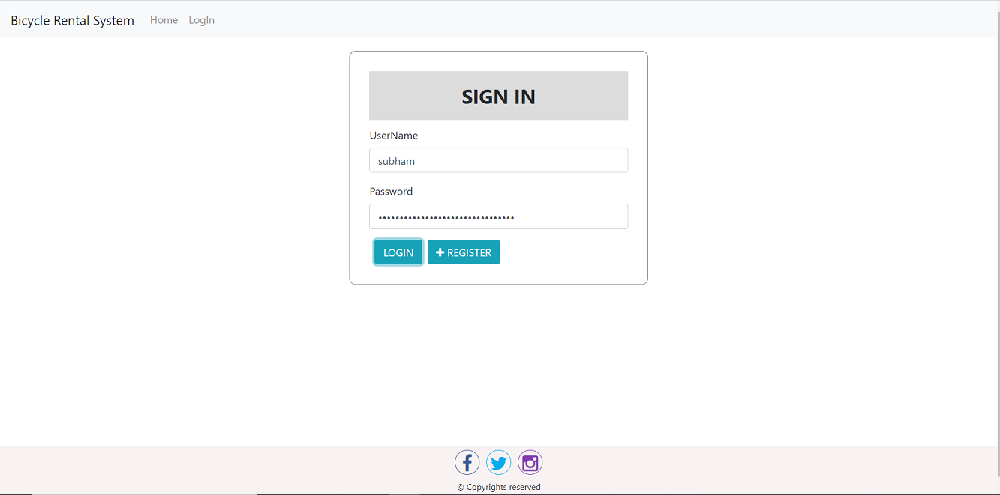
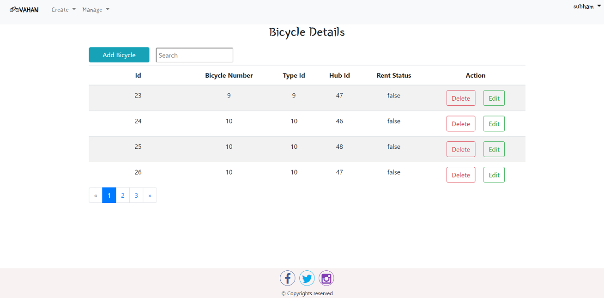
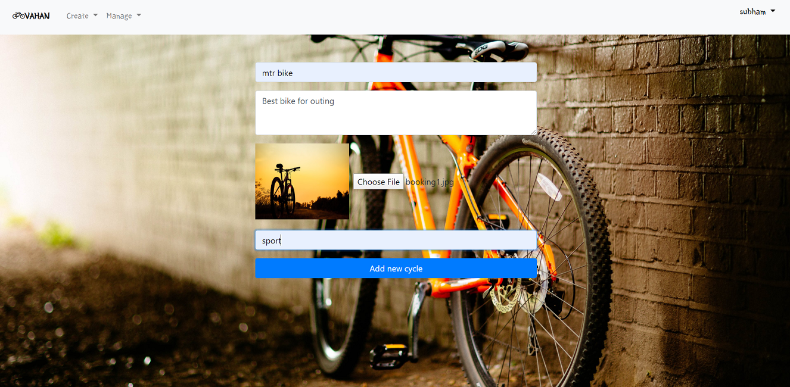
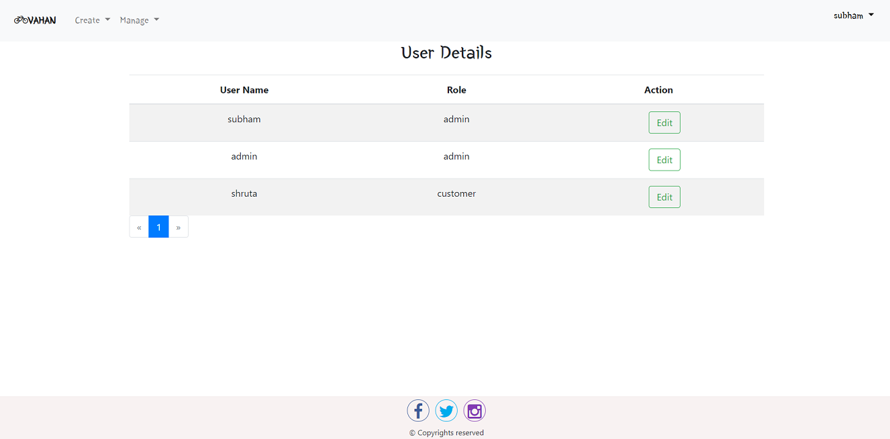

# BicycleManagement
It is multi user , it have 3 type user - admin,delivery , customer
use real time location for booking ,use of google map
upload image in cloud

# to run project Pre-requisite
update-database for creating the data
add the data connection string in appsetting.json
add a dummy google key in app.module for map
add cloud key in appsetting.json
